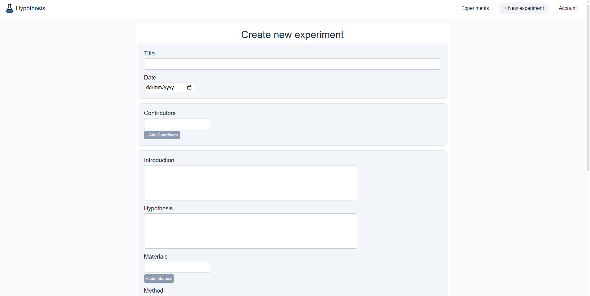

# Hypothesis
Hypothesis is a web application for documenting and organizing experiments. 

[Website](https://hypothesis.dino.icu) | [API docs](https://hypothesis.nordicpine.hackclub.app/docs)



## Features

### Accounts & Authentication
- Account creation featuring display name, username and email
- Secure password storage with modern hashing
- Protected actions using JWT tokens *(Sessions expire after 60 minutes)*

### Experiment management
- Create new experiments with multiple fields
- Create, edit and delete experiments
- Search through experiments and sort by date or title
- Clean, summarized cards for effective browsing

### Scientific structure
- Title & Date
- Contributors
- Introduction & Hypothesis
- Materials & Method
- Results, Discussion & Conclusion

## Demo account

Use the following account to explore Hypothesis:

**Username**: demo

**Password**: demo1234

The experiments in this account are fictional examples to showcase the features of Hypothesis

> Please don't modify or delete any existing demo experiment. If you create any experiments while testing, please remove them when you're finished.

## How to use

1. Sign in / Sign up
2. Click '+ New experiment' button to start creating
3. Fill out fields and click create experiment
4. Click 'Experiments' header to view your newly created experiment
5. Search and sort your experiments using the navigation tools on experiments page

## Installation
Clone the repository into your workspace: 
```bash
git clone https://github.com/RasmusStenlund/hypothesis.git

cd hypothesis
```

### Prerequisites
- Python 3.10+
- pip
- Git
- A modern web browser

### Backend setup
In the app folder you will need to create a .env file that features a secret key for hashing JWT tokens *(This is just a placeholder key)*:

**.env**
```ini
secret_key = "super_secret_hash_key"
```

Setup API:
```bash
cd app

python -m venv venv
#windows
venv\Scripts\activate
#mac/linux
source venv/bin/activate


pip install -r requirements.txt

uvicorn main:app --reload
```

### Frontend setup
This project was made in vanilla HTML, JavaScript and CSS, so only local server setup is needed. You will, however, need to change the url location in extra_functions.js to the url you host on, if locally:

**extra_functions.js**
``` js
const url = "http://127.0.0.1:8000"
```

## Future improvements
- Longer time logged in using session tokens
- Tags for experiments such as Biology, Chemistry, Bacteria
- Add other users to edit experiments
- Email authentication and password changing
- Images for experiments